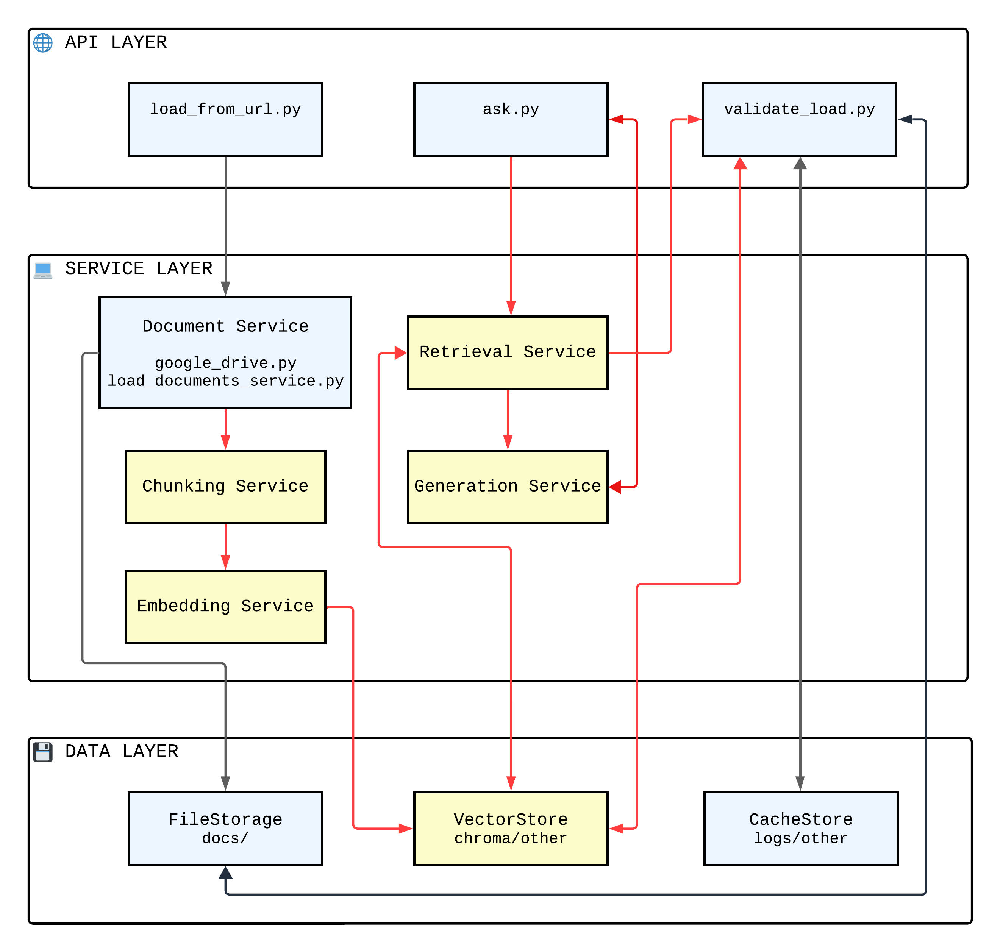

# MISW4411 Backend

## Integrantes del grupo

| Nombre completo                 |
|---------------------------------|
| Edna Katherine Conde Vega       |
| Santiago Patiño Hernandez       |

Backend del curso **Construcción de Aplicaciones basadas en Grandes Modelos de Lenguaje (MISW4411)** de la **Maestría en Ingeniería de Software – Universidad de los Andes**.

## 📋 Tabla de Contenidos

- [📖 Descripción](#descripción)
- [🏗️ Arquitectura del Sistema](#arquitectura)
- [📁 Estructura del Proyecto](#estructura)
- [📝Estado implementación](#implementacion)
- [🌐 Documentación del API](#api)
---

## 📖 <a id="descripción">Descripción

Este es un **template de API REST** desarrollado en **FastAPI** que proporciona la estructura base para implementar el proyecto del curso MISW4411.

**⚠️ IMPORTANTE**: Este template incluye la estructura completa de la API y algunos servicios base. **SU TAREA COMO ESTUDIANTES** es implementar los servicios RAG en las clases correspondientes.

---

## 📋 <a id="arquitectura">Descripción de la Arquitectura del proyecto
 
El sistema está diseñado con una **arquitectura de tres capas**. El siguiente diagrama ilustra las capas y las relaciones:



A continuación una descripción de cada una de ellas:

#### **🌐 API Layer (Capa de API)**

- **Responsabilidad**: Manejo de peticiones HTTP y validación de datos
- **Componentes**:
  - `load_from_url.py`: Carga asíncrona de documentos
  - `ask.py`: Sistema de consultas RAG
  - `validate_load.py`: Validación de estado de procesamiento
  - `health.py`: Monitoreo de salud del sistema

#### **🔧 Service Layer (Capa de Servicios)**

- **Responsabilidad**: Lógica de negocio y orquestación de funcionalidades
- **Componentes implementados** (azul):
  - `Document Service`: Descarga y manejo de documentos
  - `google_drive.py` y `load_documents_service.py`
- **Componentes por implementar** (amarillo):
  - `Chunking Service`: Fragmentación de documentos
  - `Embedding Service`: Generación de vectores
  - `Retrieval Service`: Búsqueda y reranking
  - `Generation Service`: Generación de respuestas y query rewriting

#### **💾 Data Layer (Capa de Datos)**

- **Responsabilidad**: Persistencia y almacenamiento
- **Componentes**:
  - `FileStorage (docs/)`: Documentos originales
  - `VectorStore (chroma/other)`: Base de datos vectorial
  - `CacheStore (logs/other)`: Cache y logs de procesamiento


## 📁 <a id="estructura">Estructura del Proyecto
La estructura de archivos del proyecto sigue la arquitectura descrita antes.

```
 MISW4411-Backend-Template/
├── app/
│   ├── models/                    # 📄 Modelos Pydantic
│   │   ├── ask.py                # ✅ Modelos para consultas RAG
│   │   └── load_documents.py     # ✅ Modelos para carga de documentos
│   ├── routers/                  # 🌐 Endpoints de la API
│   │   ├── ask.py               # 📝 Template para consultas (IMPLEMENTAR)
│   │   ├── load_from_url.py     # ✅ Carga de documentos (COMPLETO)
│   │   ├── validate_load.py     # ✅ Validación de procesamiento (COMPLETO)
│   │   └── health.py            # ✅ Health check (COMPLETO)
│   └── services/                 # 🔧 Servicios de negocio
│       ├── chunking_service.py  # 📝 Template para chunking (IMPLEMENTAR)
│       ├── embedding_service.py # 📝 Template para embeddings (IMPLEMENTAR)
│       ├── generation_service.py# 📝 Template para generación (IMPLEMENTAR)
│       ├── retrieval_service.py # 📝 Template para retrieval (IMPLEMENTAR)
│       ├── google_drive.py      # ✅ Integración Google Drive (COMPLETO)
│       └── load_documents_service.py # ✅ Descarga y procesamiento (COMPLETO)
├── tests/                        # 🧪 Tests automáticos
│   ├── semana1/                 # ✅ Tests básicos
│   ├── semana2/                 # ✅ Tests RAG básico
│   └── semana3/                 # ✅ Tests funcionalidades avanzadas
├── .github/workflows/           # 🔄 GitHub Actions
│   └── semana1.yml             # ✅ CI/CD para evaluación
├── postman_tests/              # 📮 Colecciones Postman para pruebas semanales
│   ├── MISW-4411-API-Proyecto.postman_collection.json
│   ├── MISW-4411-API-Proyecto-Test-Semana2.postman_collection.json
│   └── MISW-4411-API-Proyecto-Test-Semana3.postman_collection.json
├── main.py                    # ✅ Configuración FastAPI
├── requirements.txt           # 📝 Dependencias Python (IMPLEMENTAR)
├── apikey.json                # 🔑 Service account Google (CONFIGURAR)
├── .env                       # 🔑 Variables de entorno (CONFIGURAR)
├── docs/                      # 📁 Documentos descargados (auto-generado)
├── logs/                      # 📁 Logs de procesamiento (auto-generado)
└── README_ESTUDIANTES.md      # 📖 Guía detallada para estudiantes
```

**Leyenda**:

- ✅ **COMPLETO**: Ya implementado, funcional
- 📝 **TEMPLATE**: Estructura base, deben implementar o actualizar estos archivos

---

## 🎯  <a id="implementacion">Estado de Implementación

#### **✅ Entregado en Semana 1** (Azul + Negro)

Los estudiantes reciben:

- ✅ API Layer completamente funcional
- ✅ Document Service implementado
- ✅ Sistema de descarga y almacenamiento
- ✅ Validación y monitoreo básico

### 🔄 Flujo de Datos

1. **Carga de documentos**: `load_from_url.py` → `Document Service` → `FileStorage`
2. **Procesamiento** (por implementar): `Chunking` → `Embedding` → `VectorStore`
3. **Consultas RAG** (por implementar): `ask.py` → `Retrieval` + `Generation` → Respuesta

---
## 🌐 <a id="api">Documentación del API

|                                                                                                                                                                                       |
| ------------------------------------------------------------------------------------------------------------------------------------------------------------------------------------- |
| [Resumen del API ](https://github.com/MISW4411-Aplicaciones-basadas-en-LLMs/MISW4411-Backend/blob/main/resumenAPI.md)                                                                    |
| ⚠️ Para mayor información sobre el API entregada y sus respectivas pruebas, puede referirse al siguiente[enlace oficial](https://documenter.getpostman.com/view/18573230/2sB3QFSDHz). |

---

**🎓 Curso**: MISW4411 - Construcción de Aplicaciones basadas en Grandes Modelos de Lenguaje
**🏛️ Universidad**: Universidad de los Andes - Maestría en Ingeniería de Software
**📅 Año**: 2025

**¡Éxitos en sus Proyectos!**
